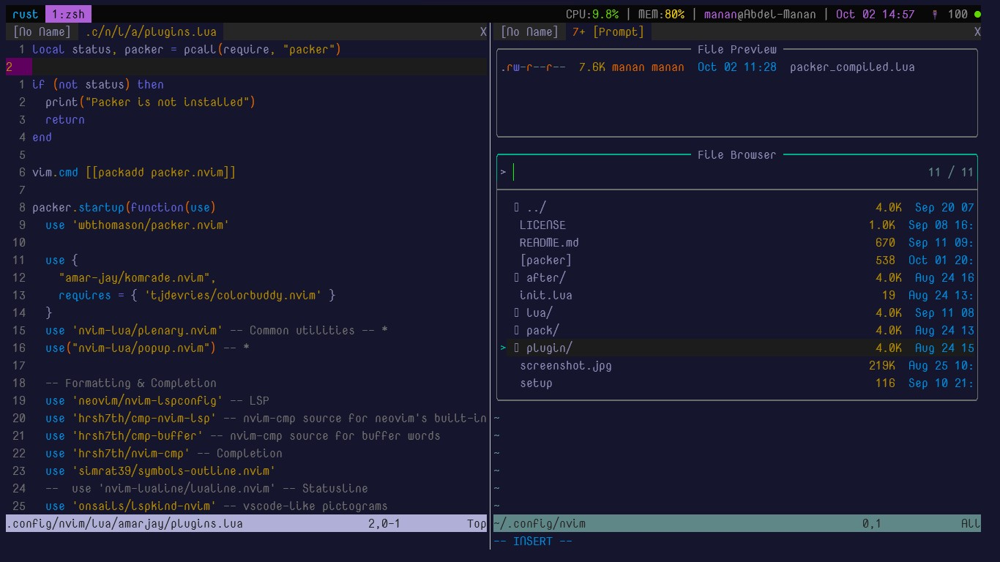

# Komrade Theme

A minimal neovim theme with;

- Multiple theme support - **TODO**
- colorbuddy.nvim support

### Configuration

Default config options

```lua
local defaults = {
  -- default config
    comment_italics = true,
    todo_bold = true,
    default_theme = "dark"
    --More to come--
}
  
```

To use this plugin with **packer.nvim**

```lua
packer.startup(function(use)
 use {
       "amar-jay/komrade.nvim",
       requires = { 'tjdevries/colorbuddy.nvim' }
     }
  -- other plugins
  end)
```

## TODO

- [ ] Allow light/dark mode change
- [ ] Better Telescope config

## Contribute

- [Contribute to this repo](./lua/komrade.lua)
